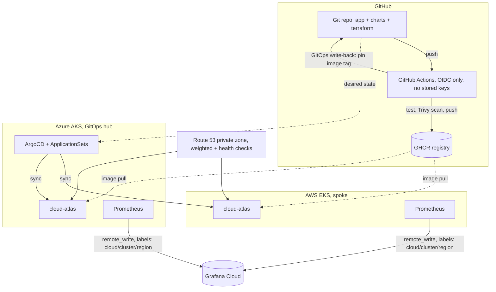

# Multi-Cloud GitOps Platform: AWS + Azure

One Git repository drives two managed Kubernetes clusters on the two most widely used enterprise clouds, AWS EKS and Azure AKS. A single ArgoCD control plane deploys to both, GitHub Actions authenticates to both clouds with zero stored credentials, and one Grafana Cloud instance shows live metrics from both clusters side by side. Route 53 handles DNS failover between them.

Push to `main`, both clusters roll out. Kill one cloud, traffic stops routing to it within about a minute. This isn't a design on paper, it was tested by actually scaling a cluster to zero and watching DNS respond in real time.

<!-- add: ArgoCD fleet screenshot, Grafana dual-cloud dashboard, DNS failover test output, demo video link -->

## Architecture



## What this actually demonstrates

| Capability | Where |
|---|---|
| Multi-cloud infrastructure from one Terraform codebase | `terraform/aws`, `terraform/azure` |
| Fleet GitOps: deploy by cluster registration, no per-cloud manifests | `argocd/cloud-atlas-appset.yaml` (cluster generator) |
| Keyless CI/CD to both clouds, AWS OIDC role and Azure federated credentials | `terraform/*/github-oidc.tf`, `.github/workflows/` |
| Supply chain security: Trivy scan gate, distroless non-root image | `app/Dockerfile`, `app-ci.yml` |
| Cross-cloud observability, one Grafana Cloud pane, per-cluster external labels | `argocd/monitoring-appset.yaml`, `monitoring/` |
| DNS-based failover, tested by actually killing a cluster | `terraform/dns/`, `docs/RUNBOOK-failover.md` |
| Cost discipline: spot nodes, single NAT, teardown scripts | `docs/COST-CONTROL.md`, `Makefile` |

## Quickstart

```bash
make up-azure       # AKS hub, free control plane
make up-aws         # EKS spoke, spot nodes
make kubeconfigs    # sets up aws / azure contexts

# install ArgoCD on the azure context (see argocd/README.md), then:
make register        # registers both clusters into the fleet with labels
kubectl --context azure apply -f argocd/cloud-atlas-appset.yaml
kubectl --context azure apply -f argocd/monitoring-appset.yaml
make status           # confirm both apps healthy on both clusters

make down-all         # tear down when done, don't leave it running
```

## Repo layout

```
app/          Go service (stdlib only) reporting cloud/cluster/region, /healthz, /metrics
charts/       One Helm chart deployed to both clouds, values injected per cluster
terraform/    aws/ azure/ for the clusters and OIDC federation, dns/ for global routing
argocd/       ApplicationSets for the app fleet and the monitoring fleet, hub setup notes
monitoring/   Grafana dashboard JSON and Prometheus alert rules
.github/      app-ci (test, scan, push, GitOps bump), terraform-ci (both clouds, keyless)
scripts/      up/down scripts, kubeconfig setup, cluster registration, failover drill
docs/         build guide, failover runbook, cost control notes, incident log, roadmap
```

## Monitoring

Both clusters run `kube-prometheus-stack`, deployed the same way as the app itself, through an ApplicationSet. Each Prometheus is tagged with external labels for `cloud`, `cluster`, and `region`, and remote-writes to a single shared Grafana Cloud instance instead of running its own Grafana. That's what makes it one pane of glass instead of two separate dashboards.

The dashboard covers request rate by cloud, total requests, app health status, pod CPU and memory, and restart counts, all split by cloud so you can watch both sides at once. Alert rules cover the app reporting unhealthy, Prometheus losing a scrape target, high CPU, and pods restarting too often.

This was verified with real traffic, not synthetic test data. I generated requests against both clusters directly and watched both metric series show up and update live in Grafana Explore before building the dashboard on top.

## DNS failover

`terraform/dns` uses a Route 53 **private** hosted zone associated with the AWS VPC, not a public domain. I didn't buy a domain for this, since the only real use here is a portfolio demo and a domain would be a recurring cost for something I don't need to keep resolving publicly. The tradeoff is that it only resolves from inside the AWS VPC, so the failover test below is run from a pod inside the cluster with `nslookup`, not from a browser.

Setup: `app.atlas.internal` is a weighted CNAME split across `aws.app.atlas.internal` and `azure.app.atlas.internal`, each backed by an HTTP health check against `/healthz`.

The actual test: scaled the Azure deployment to zero replicas, waited for the health check to fail, then ran repeated `nslookup app.atlas.internal` from a throwaway busybox pod inside the AWS cluster. Every single lookup resolved to `aws.app.atlas.internal`, Azure disappeared from the answers completely. Scaled Azure back up to two replicas and the weighted split came back within a couple of DNS cycles.

## What went wrong along the way

Nothing here worked on the first try. Ten real issues came up during the build, from AKS rejecting the default VM size for this subscription to an AWS account-level restriction on Load Balancer creation that took an actual support ticket to get lifted, not a config change. Full writeup with root causes and fixes is in [docs/INCIDENTS.md](docs/INCIDENTS.md). A few worth mentioning here:

- **Trivy blocked the build on Go 1.24 stdlib CVEs.** Turned out Go only backports security patches to the latest two major releases, so once 1.24 aged out it started failing the scan on its own standard library. Fixed by bumping to Go 1.26.
- **AWS refused to create a Load Balancer**, and it wasn't IAM or a service quota, both of which looked fine. It was an account-level trust restriction that only AWS Support could remove. Opened a case, they lifted it, the NLB provisioned on the next sync.
- **The private DNS zone failed to associate with the VPC** because Route 53 defaults that association call to `us-east-1` regardless of where your VPC actually is. Fixed by setting `vpc_region` explicitly.

## Status

v1.0 is complete: both clusters live, GitOps fleet management working, keyless CI/CD to both clouds proven through actual Actions logs, cross-cloud monitoring proven with real traffic, DNS failover proven with a real test.

Roadmap items, tracked in [docs/ROADMAP.md](docs/ROADMAP.md): ExternalDNS and cert-manager, External Secrets Operator, Karpenter, centralized logging with Loki (deliberately left out of v1.0 to avoid scope creep once the core platform was already proven), swapping the private DNS zone for a public one if this ever needs to be reachable from outside the cluster, and a third cloud. Since the fleet pattern is provider-agnostic, adding GKE is one new Terraform directory and an `argocd cluster add`, not a redesign.

## Design decisions

- **Hub on AKS, not EKS.** The Azure free-tier control plane plus the $200 credit keep the hub running all week at no cost, while AWS gets torn down daily to control spend and rejoins the fleet in minutes when it comes back up.
- **One chart, per-cluster values from cluster secret labels.** No per-cloud manifest drift, and adding a third cloud is a registration command, not new YAML.
- **GHCR as the single registry.** Keeps delivery registry-agnostic. Per-cloud registries like ECR or ACR are a documented extension, not a requirement.
- **Private DNS zone instead of a public domain.** Explained above under DNS failover. Same weighted routing and health check mechanics a production setup would use, just proven from inside the cluster instead of a browser, to avoid paying for a domain on a portfolio project.
- **DNS-level failover, not a global mesh.** Simplest mechanism that genuinely survives losing a whole cloud. Something like Front Door or CloudFront at L7 is the natural next step, not a requirement for proving the pattern.
- **CI plans, humans apply Terraform.** Right-sized for a solo operator. CI still proves keyless auth to both clouds on every push, it just doesn't hold the keys to actually change infrastructure unattended.
