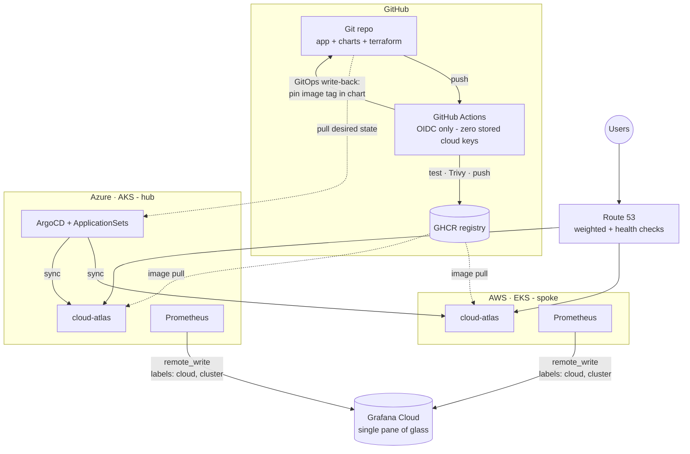

# Multi-Cloud GitOps Platform — AWS · Azure

One Git repository drives a fleet of Kubernetes clusters across the two most
widely adopted enterprise clouds — **AWS EKS and Azure AKS** — with a single
ArgoCD control plane, keyless (OIDC) CI/CD, one Grafana pane of glass, and
health-checked global DNS that survives the loss of an entire cloud.

> Merge to `main` → both clouds roll out. Kill a cloud → traffic re-routes
> in under two minutes. Nobody SSHes anywhere.

<!-- Add: Argo fleet screenshot · Grafana 2-cloud graph · failover CSV · demo video link -->

## Architecture



## What this demonstrates (interview map)
| Capability | Where |
|---|---|
| Multi-cloud IaC (same patterns, two providers) | `terraform/{aws,azure}` |
| Fleet GitOps: deploy-by-cluster-registration | `argocd/cloud-atlas-appset.yaml` (cluster generator) |
| Keyless CI/CD: AWS OIDC role + Azure federated credentials | `terraform/*/github-oidc.tf`, `.github/workflows/` |
| Supply-chain hygiene: Trivy gate, distroless non-root image | `app/Dockerfile`, `app-ci.yml` |
| Federated observability: external labels + remote_write | `argocd/monitoring-appset.yaml`, `monitoring/` |
| Global resilience: active-active DNS, measured RTO | `terraform/dns/`, `docs/RUNBOOK-failover.md` |
| Cost engineering: spot/burstable nodes, teardown discipline | `docs/COST-CONTROL.md`, `Makefile` |

## Quickstart
```bash
make up-azure              # hub cluster (AKS, free credit)
make up-aws                # spoke
make kubeconfigs           # contexts: aws / azure
# install ArgoCD on azure (argocd/README.md), then:
make register              # label clusters into the fleet
kubectl --context azure apply -f argocd/cloud-atlas-appset.yaml
make status                # both clusters, same app, each self-identifying
make down-all              # ALWAYS, when done
```

## Repo layout
```
app/          Go service (stdlib-only) reporting cloud/cluster/region; /healthz, /metrics
charts/       One Helm chart deployed to both clouds (values injected per cluster)
terraform/    aws/ azure/ cluster + OIDC federation; dns/ global routing
argocd/       ApplicationSets (app fleet + monitoring fleet), hub setup
.github/      app-ci (test→scan→push→GitOps bump), terraform-ci (2-cloud keyless)
scripts/      up/down (cost), kubeconfigs, cluster registration, failover drill
docs/         6-day build guide, failover runbook, cost control, incident log
```

## Status & roadmap
**v1.0 in progress** - built in public over one week. See [docs/ROADMAP.md](docs/ROADMAP.md):
next up are ExternalDNS + cert-manager, External Secrets Operator, Karpenter -
and because the fleet is provider-agnostic, adding a third cloud (GKE) is one
Terraform directory plus `argocd cluster add`.

## Design decisions
- **Hub on AKS, not EKS** — the $200 Azure credit + free AKS control plane keep the hub alive all week for $0, while AWS (real money) is torn down daily and re-joins the fleet in minutes.
- **One chart, per-cluster values from cluster-secret labels** — no per-cloud manifest drift; adding cloud #3 is `argocd cluster add`.
- **GHCR as the single registry** — registry-agnostic delivery; per-cloud registries (ECR/ACR) are a documented extension.
- **DNS-level failover, not a global mesh** — simplest mechanism that genuinely survives a cloud loss; L7 (Front Door / CloudFront) is the next iteration.
- **CI plans, human applies** — right-sized for a solo operator; CI still proves keyless auth to both clouds on every PR.
